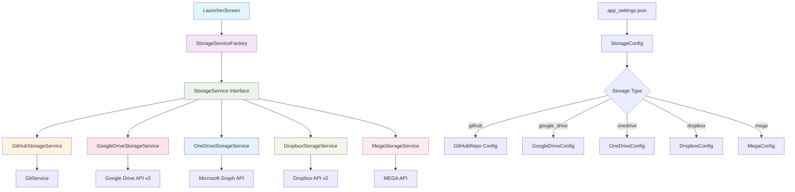

# 🚀 Universal Launcher App

A modern, flexible desktop launcher application that supports multiple cloud storage providers for app distribution and automatic updates. Built with Flutter for Windows with a clean, extensible architecture.

## ✨ Features

- **Multi-Cloud Support**: GitHub, Google Drive, OneDrive, and Dropbox
- **Automatic Updates**: Intelligent version checking and seamless updates
- **Large File Support**: Handles 2-3GB applications with ease
- **Factory Pattern**: Clean, extensible architecture for adding new storage providers
- **Progress Tracking**: Real-time download and update progress
- **Offline Support**: Works offline with cached local versions
- **Modern UI**: Beautiful, responsive Flutter interface
- **Configurable**: JSON-based configuration for easy customization

## 🎯 Supported Storage Providers

| Provider | Free Storage | Max File Size | Large Files (2-3GB) | API Quality |
|----------|--------------|---------------|---------------------|-------------|
| 🐙 **GitHub** | Unlimited* | 2GB (with LFS) | ✅ | ⭐⭐⭐⭐⭐ |
| 🔵 **Google Drive** | 15GB | 750GB | ✅ | ⭐⭐⭐⭐⭐ |
| Ⓜ️ **OneDrive** | 5GB | 250GB | ✅ | ⭐⭐⭐⭐ |
| 📦 **Dropbox** | 2GB | No limit | ✅ | ⭐⭐⭐⭐ |
| 🔥 **MEGA** | 20GB | No limit | ✅ | ⭐⭐⭐⭐ |

*GitHub: Free for public repositories

## 📊 Free Tier Limitations & Restrictions

Understanding the limitations of each free storage provider is crucial for choosing the right option for your application distribution needs.

### Storage & File Limits

| Provider | Free Storage | Max File Size | Monthly Bandwidth | API Rate Limits |
|----------|--------------|---------------|-------------------|-----------------|
| 🔥 **MEGA** | 20GB | Unlimited | 1TB/month | 1000 reqs/hour |
| 🔵 **Google Drive** | 15GB* | 750GB | Unlimited | 1000 reqs/100s |
| 🐙 **GitHub** | Unlimited† | 2GB (LFS) | 1GB/month (LFS) | 5000 reqs/hour |
| Ⓜ️ **OneDrive** | 5GB | 250GB | Unlimited | Variable |
| 📦 **Dropbox** | 2GB | Unlimited | Unlimited | 300 reqs/hour |

*Shared across all Google services  
†Free for public repositories only

### Detailed Limitations by Provider

#### 🔥 MEGA (Best for Large Files)
**✅ Advantages:**
- Largest free storage (20GB)
- No file size limits
- Strong encryption
- Good bandwidth allowance

**⚠️ Limitations:**
- **Transfer Quota**: 1TB download per month (resets monthly)
- **Speed Throttling**: Reduced speed after quota exceeded
- **API Limits**: 1000 requests per hour
- **Account Verification**: Phone verification required
- **Inactivity**: Account deletion after 3 months of inactivity

#### 🔵 Google Drive (Best Overall)
**✅ Advantages:**
- Reliable infrastructure
- Excellent integration
- Strong API ecosystem
- Generous file size limits

**⚠️ Limitations:**
- **Shared Storage**: 15GB shared with Gmail, Photos, etc.
- **API Quotas**: 1000 requests per 100 seconds per user
- **Daily Upload**: 750GB per day limit
- **Bandwidth**: Soft limits on excessive usage
- **Account Requirements**: Google account verification needed

#### 🐙 GitHub (Best for Developers)
**✅ Advantages:**
- Unlimited repository size for public repos
- Excellent version control
- Great for open source projects
- Strong developer ecosystem

**⚠️ Limitations:**
- **Private Repos**: Not free (paid plans required)
- **LFS Bandwidth**: 1GB/month for Git LFS
- **LFS Storage**: 1GB included, then paid
- **File Size**: 100MB max without LFS, 2GB with LFS
- **API Rate Limits**: 5000 requests/hour for authenticated users

#### Ⓜ️ OneDrive (Best for Microsoft Users)
**✅ Advantages:**
- Good integration with Windows
- Microsoft ecosystem benefits
- Decent file size limits
- Office Online integration

**⚠️ Limitations:**
- **Small Storage**: Only 5GB free
- **API Throttling**: Variable rate limits based on usage patterns
- **File Types**: Some file types restricted
- **Sync Limitations**: Limited number of devices for sync
- **Account Requirements**: Microsoft account needed

#### 📦 Dropbox (Easiest Setup)
**✅ Advantages:**
- Simple setup process
- No file size limits
- Good sync reliability
- Easy sharing features

**⚠️ Limitations:**
- **Small Storage**: Only 2GB free (smallest of all)
- **Device Limit**: 3 devices max for free accounts
- **Version History**: 30 days only
- **API Rate Limits**: 300 requests per hour
- **Bandwidth**: Soft limits on public links

### Usage Recommendations by File Size

| App Size | Primary Choice | Secondary Choice | Avoid |
|----------|----------------|------------------|-------|
| **< 100MB** | Any provider | Google Drive | - |
| **100MB - 1GB** | MEGA, Google Drive | OneDrive | GitHub (without LFS) |
| **1GB - 2GB** | MEGA, Google Drive | Dropbox | OneDrive |
| **2GB - 5GB** | MEGA | Google Drive | OneDrive, Dropbox |
| **5GB+** | MEGA only | Upgrade to paid plans | All others |

### Quota Management Tips

#### For High-Usage Applications:
1. **MEGA**: Monitor transfer quota; consider multiple accounts
2. **Google Drive**: Use service accounts for higher quotas
3. **GitHub**: Implement LFS carefully; monitor bandwidth
4. **OneDrive**: Consider Microsoft 365 subscription
5. **Dropbox**: Upgrade to paid plan for serious usage

#### Best Practices:
- **Monitor Usage**: Track bandwidth and storage consumption
- **Implement Caching**: Reduce unnecessary downloads
- **User Education**: Inform users about quota limitations
- **Fallback Strategy**: Have multiple storage options available
- **Compression**: Use efficient compression for large files

## 🏗️ Architecture



## 🚀 Quick Start

### 1. Configuration
Edit `assets/config/app_settings.json`:

   ```json
   {
  "app_name": "My Awesome App",
  "storage": {
    "type": "google_drive",
    "google_drive": {
      "client_id": "your_client_id.apps.googleusercontent.com",
      "folder_id": "your_google_drive_folder_id",
      "credentials_path": "assets/credentials/google_drive_credentials.json"
    }
  },
  "local_folder": "C:\\Program Files\\MyApp",
  "exe_file_name": "MyApp.exe"
}
```

### 2. Switch Storage Providers
Simply change the `type` field:
```json
{
  "storage": {
    "type": "mega"  // github | google_drive | onedrive | dropbox | mega
  }
}
```

### 3. Run the App
   ```bash
flutter run -d windows
```

## 📚 Detailed Setup Guides

For comprehensive setup instructions for each storage provider, see:

### 📖 [**STORAGE_SETUP_GUIDE.md**](./STORAGE_SETUP_GUIDE.md)

This guide includes:
- Step-by-step setup for all 4 storage providers
- API key generation instructions
- OAuth2 configuration
- Credential file creation
- Troubleshooting tips
- File size and storage limits
- Additional free storage options (MEGA, pCloud, etc.)

## 🔧 Installation & Development

### Prerequisites
- Flutter 3.10.0 or higher
- Windows 10/11
- Git (for GitHub storage)

### Clone & Setup
```bash
git clone https://github.com/yourusername/launcher.git
cd launcher
flutter pub get
```

### Build for Production
```bash
flutter build windows --release
```

## 📁 Project Structure

```
launcher/
├── 📁 lib/
│   ├── 📁 models/
│   │   └── app_config.dart          # Configuration models
│   ├── 📁 services/
│   │   ├── storage_service.dart      # Abstract storage interface
│   │   ├── github_storage_service.dart
│   │   ├── google_drive_storage_service.dart
│   │   ├── onedrive_storage_service.dart
│   │   ├── dropbox_storage_service.dart
│   │   └── storage_service_factory.dart
│   └── 📁 screens/
│       └── launcher_screen.dart      # Main UI
├── 📁 assets/
│   ├── 📁 config/
│   │   └── app_settings.json        # Main configuration
│   └── 📁 credentials/
│       ├── google_drive_credentials.json
│       ├── onedrive_credentials.json
│       ├── dropbox_credentials.json
│       └── mega_credentials.json
├── 📄 STORAGE_SETUP_GUIDE.md       # Detailed setup guide
└── 📄 README.md                    # This file
```

## 🎮 Usage Examples

### Basic Configuration
```json
{
  "storage": {
    "type": "github",
    "github": {
      "url": "https://github.com/user/app-releases",
      "branch": "main"
    }
  }
}
```

### Advanced Configuration
```json
{
  "app_name": "Game Launcher",
  "storage": {
    "type": "google_drive",
    "google_drive": {
      "client_id": "123.apps.googleusercontent.com",
      "folder_id": "1BxiMVs0XRA5nFMdKvBdBZjgmUUqptlbs74OgvE2upms",
      "credentials_path": "assets/credentials/google_drive_credentials.json"
    }
  },
  "local_folder": "C:\\Games\\MyGame",
  "background_image": "assets/images/game_bg.jpg",
  "update_check_interval": 300000,
  "exe_file_name": "MyGame.exe",
  "app_icon": "assets/icons/game.ico"
}
```

## 🔄 How It Works

1. **Initialization**: App loads configuration and creates appropriate storage service
2. **Version Check**: Compares local and remote versions
3. **Download/Update**: Downloads new files if updates available
4. **Launch**: Runs the target executable
5. **Monitoring**: Tracks process status and handles lifecycle

### Update Flow
```
Check Config → Initialize Storage → Check Updates → Download → Extract → Launch
```

## 🌟 Free Storage Options for Large Files

For apps requiring 2-3GB+:

| Provider | Free Storage | Best For |
|----------|--------------|----------|
| **Google Drive** | 15GB | Reliability & integration |
| **pCloud** | 10GB | No file size limits |
| **Koofr** | 10GB | Privacy-focused (EU) |
| **Yandex.Disk** | 10GB | Alternative option |
| **GitHub LFS** | 1GB/month | Version control |

## 🔒 Security & Best Practices

### Credential Management
- Store credentials in separate files
- Use environment variables for sensitive data
- Implement token refresh mechanisms
- Never commit credentials to version control

### API Rate Limits & Quota Management
- **Implement exponential backoff** for rate limit errors
- **Cache responses** when possible to reduce API calls
- **Monitor quotas** - track usage against provider limits
- **Use official SDKs** when available for better error handling
- **Implement fallback** - switch providers when quotas exceeded

### Free Tier Optimization
- **Compress files** to stay within storage limits
- **Delta updates** to minimize bandwidth usage  
- **User notifications** about quota status
- **Smart caching** to avoid repeated downloads
- **Multiple accounts** for high-usage scenarios (where allowed)

## 🤝 Contributing

### Adding New Storage Providers

1. Create a new service implementing `StorageService`:
```dart
class NewProviderStorageService extends StorageService {
  // Implement all abstract methods
}
```

2. Add to factory:
```dart
case StorageType.newProvider:
  return NewProviderStorageService(config.newProvider);
```

3. Update configuration models
4. Add setup guide documentation

### Current Architecture Benefits
- **Extensible**: Easy to add new providers
- **Testable**: Each service can be tested independently
- **Maintainable**: Clean separation of concerns
- **Configurable**: No code changes needed to switch providers

## 📊 Performance & Limits

### File Size Strategy by Provider
- **< 100MB**: Any provider works well
- **100MB - 1GB**: MEGA, Google Drive, or GitHub with LFS
- **1GB - 2GB**: MEGA (best choice) or Google Drive  
- **2GB - 5GB**: MEGA only among free tiers
- **5GB+**: Upgrade to paid plans or use MEGA with multiple accounts

### Bandwidth Considerations
- **MEGA**: 1TB/month limit - plan for user distribution
- **GitHub LFS**: 1GB/month - suitable for small user bases
- **Others**: Generally unlimited but subject to fair use policies

### Network Optimization
- Chunked downloads for large files
- Resume capability for interrupted downloads
- Progress tracking with user feedback
- Bandwidth throttling options

## 🐛 Troubleshooting

### Common Issues
- **Authentication failures**: Check credential files and API keys
- **File not found**: Verify file paths and folder IDs
- **Download timeouts**: Check network connection and file size
- **Permission errors**: Ensure proper API scopes and folder permissions
- **Quota exceeded**: Switch to different provider or upgrade plan
- **Rate limit errors**: Implement retry logic with exponential backoff

### Free Tier Specific Issues

#### MEGA
- **Transfer quota exceeded**: Wait for monthly reset or use different account
- **Speed throttling**: Download speed reduced after quota limit
- **Account inactive**: Login at least once every 3 months

#### Google Drive  
- **Storage full**: Clean up Gmail/Photos or upgrade storage
- **API quota exceeded**: Implement proper rate limiting
- **Daily upload limit**: Spread large uploads across multiple days

#### GitHub
- **LFS bandwidth exceeded**: Monitor usage or upgrade plan
- **File too large**: Use LFS for files > 100MB
- **Private repo limit**: Use public repos or upgrade plan

#### OneDrive/Dropbox
- **Storage limit reached**: Clean up files or upgrade plan
- **API throttling**: Implement proper request spacing

### Debug Mode
Enable detailed logging:
```json
{
  "debug_mode": true,
  "log_level": "verbose"
}
```

## 📄 License

This project is licensed under the MIT License - see the [LICENSE](LICENSE) file for details.

### Quick Start Recommendations

- **For Beginners**: Start with **Dropbox** (easiest setup, but only 2GB)
- **For Developers**: Use **GitHub** (version control benefits, unlimited public repos)
- **For Large Files**: Use **MEGA** (20GB free + unlimited file size) or **Google Drive** (15GB)
- **For Privacy**: Use **MEGA** (end-to-end encryption) or **OneDrive**
- **For Enterprise**: Consider **Google Drive** (best API ecosystem)

### Free Tier Comparison Summary

🥇 **Best Free Storage**: MEGA (20GB)  
🥇 **Best for Large Files**: MEGA (no size limits)  
🥇 **Best API**: Google Drive (most reliable)  
🥇 **Best for Developers**: GitHub (version control)  
🥇 **Easiest Setup**: Dropbox (simple auth)

⚠️ **Limitations to Consider**:
- MEGA: 1TB/month transfer limit
- Google Drive: Shared 15GB across Google services  
- GitHub: Public repos only for free tier
- OneDrive: Only 5GB free storage
- Dropbox: Only 2GB free storage, 3 device limit

## 🙏 Acknowledgments

- Flutter team for the excellent framework
- Storage providers for their generous free tiers
- Community contributors and testers

## 📞 Support

- 📖 Check the [Storage Setup Guide](./STORAGE_SETUP_GUIDE.md)
- 🐛 [Report Issues](https://github.com/yourusername/launcher/issues)
- 💡 [Feature Requests](https://github.com/yourusername/launcher/discussions)
- 📧 [Email Support](mailto:support@yourapp.com)

---

**Built with ❤️ using Flutter**

*Transform any desktop application into a modern, auto-updating launcher with **5 cloud storage providers** including **MEGA's 20GB free tier**.*